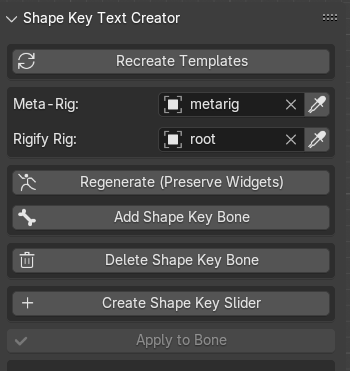

# Shape Key Bone Control Creator

[English](#english) | [한글](#korean) | [日本語](#japanese) | [中文](#chinese)

<code style="color: #0366d6; background-color: #f6f8fa; padding: 16px; display: block;">
Shape Key Bone Control Creator is a Blender add-on that helps you visualize and control shape keys through bone-based sliders.
</code>

## Preview / 미리보기 / プレビュー / 预览

<code style="color: #d73a49; font-size: 1.1em;">▶️ Watch on YouTube / 유튜브에서 보기 / YouTubeで見る / 在YouTube上观看</code>

[Shape Keys Bone And Custom Shape Creater - Blender Face Animation Add-on](https://youtu.be/ZL2vitS9E3M)

## Version History / 버전 기록 / バージョン履歴 / 版本历史

<code style="color: #0366d6; font-size: 1.1em;">📌 v1.1.8 (2025-02-09)</code>

<code style="color: #28a745;">🇺🇸 English</code>

**Widget System Enhancement**
- Add mesh and shape key selection to sync operator
  - Add direct shape key selection UI
  - Improve widget collection filtering
  - Add automatic default selection
- Standardize widget transform calculations
  - Unify transform calculation logic
  - Improve shape key range handling
  - Standardize offset calculations

**UI/UX Improvements**
- Enhance collection selection interface
  - Filter to show only Widgets collection children
  - Add automatic collection detection
  - Improve collection name handling
- Add intelligent default selection
  - Add shape key name detection from bone name
  - Improve initial value selection
  - Add automatic widget collection matching

**Bug Fixes**
- Fix widget position calculation issues
- Fix collection selection filtering
- Improve sync operation stability

<code style="color: #28a745;">🇰🇷 한글</code>

**위젯 시스템 강화**
- 싱크 오퍼레이터에 메쉬와 쉐이프 키 선택 추가
  - 직접 쉐이프 키 선택 UI 추가
  - 위젯 컬렉션 필터링 개선
  - 자동 기본값 선택 추가
- 위젯 트랜스폼 계산 표준화
  - 트랜스폼 계산 로직 통일
  - 쉐이프 키 범위 처리 개선
  - 오프셋 계산 표준화

**UI/UX 개선**
- 컬렉션 선택 인터페이스 강화
  - Widgets 컬렉션 자식만 표시하도록 필터링
  - 자동 컬렉션 감지 추가
  - 컬렉션 이름 처리 개선
- 지능형 기본값 선택 추가
  - 본 이름에서 쉐이프 키 이름 감지 추가
  - 초기값 선택 개선
  - 자동 위젯 컬렉션 매칭 추가

**버그 수정**
- 위젯 위치 계산 문제 수정
- 컬렉션 선택 필터링 수정
- 싱크 작업 안정성 개선

<code style="color: #28a745;">🇯🇵 日本語</code>

**ウィジェットシステムの強化**
- 同期オペレーターにメッシュとシェイプキーの選択を追加
  - 直接シェイプキー選択UIの追加
  - ウィジェットコレクションフィルタリングの改善
  - 自動デフォルト選択の追加
- ウィジェットトランスフォーム計算の標準化
  - トランスフォーム計算ロジックの統一
  - シェイプキー範囲処理の改善
  - オフセット計算の標準化

**UI/UX改善**
- コレクション選択インターフェースの強化
  - Widgetsコレクションの子のみ表示するフィルタリング
  - 自動コレクション検出の追加
  - コレクション名処理の改善
- インテリジェントデフォルト選択の追加
  - ボーン名からシェイプキー名を検出
  - 初期値選択の改善
  - 自動ウィジェットコレクションマッチングの追加

**バグ修正**
- ウィジェット位置計算の問題を修正
- コレクション選択フィルタリングの修正
- 同期操作の安定性向上

<code style="color: #28a745;">🇨🇳 中文</code>

**部件系统增强**
- 为同步操作添加网格和形态键选择
  - 添加直接形态键选择界面
  - 改进部件集合过滤
  - 添加自动默认选择
- 标准化部件变换计算
  - 统一变换计算逻辑
  - 改进形态键范围处理
  - 标准化偏移计算

**UI/UX改进**
- 增强集合选择界面
  - 仅显示Widgets集合子项的过滤
  - 添加自动集合检测
  - 改进集合名称处理
- 添加智能默认选择
  - 从骨骼名称检测形态键名称
  - 改进初始值选择
  - 添加自动部件集合匹配

**错误修复**
- 修复部件位置计算问题
- 修复集合选择过滤
- 改进同步操作稳定性

<code style="color: #0366d6; font-size: 1.1em;">📌 v1.1.7 (2025-02-09)</code>

<code style="color: #28a745;">🇺🇸 English</code>

**Parent Relationship Preservation**
- Add bone parent preservation during regeneration
  - Store parent bone information
  - Restore parent relationships in edit mode
  - Maintain bone hierarchies
- Improve regeneration workflow
  - Add proper mode switching
  - Handle parent bones correctly
  - Maintain bone structure

**Widget System Enhancement**
- Simplify widget preservation system
  - Remove unnecessary data storage
  - Focus on essential widget data
  - Improve code efficiency
- Add proper mode handling
  - Add edit mode switching for parent setup
  - Improve mode restoration
  - Add safety checks

**Bug Fixes**
- Fix widget restoration process
- Fix parent bone handling
- Improve error handling

<code style="color: #28a745;">🇰🇷 한글</code>

**부모 관계 보존**
- 리제네레이트 시 본 부모 관계 보존 추가
  - 부모 본 정보 저장
  - 에딧 모드에서 부모 관계 복원
  - 본 계층 구조 유지
- 리제네레이트 워크플로우 개선
  - 적절한 모드 전환 추가
  - 부모 본 올바르게 처리
  - 본 구조 유지

**위젯 시스템 강화**
- 위젯 보존 시스템 단순화
  - 불필요한 데이터 저장 제거
  - 핵심 위젯 데이터에 집중
  - 코드 효율성 개선
- 적절한 모드 처리 추가
  - 부모 설정을 위한 에딧 모드 전환 추가
  - 모드 복원 개선
  - 안전성 체크 추가

**버그 수정**
- 위젯 복원 프로세스 수정
- 부모 본 처리 수정
- 오류 처리 개선

<code style="color: #28a745;">🇯🇵 日本語</code>

**親子関係の保持**
- リジェネレート時のボーンの親子関係保持を追加
  - 親ボーン情報の保存
  - 編集モードでの親子関係の復元
  - ボーン階層構造の維持
- リジェネレートワークフローの改善
  - 適切なモード切り替えの追加
  - 親ボーンの適切な処理
  - ボーン構造の維持

**ウィジェットシステムの強化**
- ウィジェット保持システムの簡素化
  - 不要なデータ保存の削除
  - 重要なウィジェットデータに焦点を当て
  - コード効率の改善
- 適切なモード処理の追加
  - 親設定のための編集モード切り替えを追加
  - モード復元の改善
  - 安全性チェックの追加

**バグ修正**
- ウィジェット復元プロセスの修正
- 親ボーン処理の修正
- エラー処理の改善

<code style="color: #28a745;">🇨🇳 中文</code>

**父级关系保持**
- 添加重新生成时的骨骼父级关系保持
  - 保存父级骨骼信息
  - 在编辑模式下恢复父级关系
  - 维持骨骼层级结构
- 改进重新生成工作流程
  - 添加适当的模式切换
  - 正确处理父级骨骼
  - 维持骨骼结构

**部件系统增强**
- 简化部件保持系统
  - 删除不必要的数据存储
  - 专注于核心部件数据
  - 提高代码效率
- 添加适当的模式处理
  - 添加用于父级设置的编辑模式切换
  - 改进模式恢复
  - 添加安全性检查

**错误修复**
- 修复部件恢复流程
- 修复父级骨骼处理
- 改进错误处理

<code style="color: #0366d6; font-size: 1.1em;">📌 v1.1.6 (2025-02-09)</code>

<code style="color: #28a745;">🇺🇸 English</code>

**Widget Preservation System**
- Add widget preservation during rigify regeneration
  - Store custom widget settings before regeneration
  - Restore widget settings after regeneration
  - Maintain widget positions and transformations
- Improve widget handling reliability
  - Preserve widget collections
  - Maintain widget relationships
  - Keep shape key connections

**Driver Value Enhancement**
- Add intelligent driver value handling
  - Detect and use existing driver values
  - Preserve original multiplier values
  - Remove hardcoded default values
- Improve driver setup consistency
  - Better value detection
  - Proper error handling
  - Maintain mathematical relationships

**Sync System Improvements**
- Add automatic sync functionality
  - Add sync enable/disable toggle
  - Optimize sync operations
  - Add proper error handling
- Clean up sync system
  - Remove redundant updates
  - Improve code efficiency
  - Better error reporting

**Post-Regeneration Workflow**
- Add automatic workflow after regeneration
  - Auto-hide metarig after regeneration
  - Auto-clear all selections
  - Auto-switch to pose mode
- Add multilingual support
  - Add translations for regeneration UI
  - Add translations for widget preservation
  - Improve user feedback messages

**Bug Fixes**
- Fix widget reset on regeneration
- Fix default driver values
- Remove unnecessary shape key updates

**Widget System Fixes**
- Fix widget preservation during regeneration
  - Add proper mode handling for widget operations
  - Fix custom shape assignment issues
  - Improve bone name mapping system
- Optimize widget handling process
  - Remove unnecessary property transfers
  - Focus on essential widget data
  - Add proper existence checks

**Important Note**
- Always use the addon's "Regenerate (Preserve Widgets)" button
- Using Blender's default regenerate button will result in:
  - Loss of all custom widgets starting with 'WGT_shape_key_ctrl'
  - Reset of all shape key control relationships
  - Loss of custom widget positions and settings

<code style="color: #28a745;">🇰🇷 한글</code>

**위젯 보존 시스템**
- 리기파이 리제네레이트 시 위젯 보존 기능 추가
  - 리제네레이트 전 커스텀 위젯 설정 저장
  - 리제네레이트 후 위젯 설정 복원
  - 위젯 위치와 변환 유지
- 위젯 처리 안정성 개선
  - 위젯 컬렉션 보존
  - 위젯 관계 유지
  - 쉐이프 키 연결 유지

**드라이버 값 개선**
- 지능형 드라이버 값 처리 추가
  - 기존 드라이버 값 감지 및 사용
  - 원본 승수 값 보존
  - 하드코딩된 기본값 제거
- 드라이버 설정 일관성 개선
  - 더 나은 값 감지
  - 적절한 오류 처리
  - 수학적 관계 유지

**동기화 시스템 개선**
- 자동 동기화 기능 추가
  - 동기화 활성화/비활성화 토글
  - 동기화 작업 최적화
  - 적절한 오류 처리
- 동기화 시스템 정리
  - 불필요한 업데이트 제거
  - 코드 효율성 개선
  - 더 나은 오류 보고

**리제네레이트 후처리 워크플로우**
- 리제네레이트 후 자동 워크플로우 추가
  - 리제네레이트 후 메타리그 자동 숨김
  - 모든 선택 자동 해제
  - 포즈 모드 자동 전환
- 다국어 지원 추가
  - 리제네레이트 UI 번역 추가
  - 위젯 보존 관련 번역 추가
  - 사용자 피드백 메시지 개선

**버그 수정**
- 리제네레이트 시 위젯 초기화 문제 수정
- 기본 드라이버 값 수정
- 불필요한 쉐이프 키 업데이트 제거

**위젯 시스템 수정**
- 리제네레이트 시 위젯 보존 수정
  - 위젯 작업을 위한 적절한 모드 처리 추가
  - 커스텀 쉐이프 할당 문제 수정
  - 본 이름 매핑 시스템 개선
- 위젯 처리 프로세스 최적화
  - 불필요한 속성 전송 제거
  - 핵심 위젯 데이터에 집중
  - 적절한 존재 여부 확인 추가

**중요 사항**
- 반드시 애드온의 "리제네레이트 (위젯 유지)" 버튼을 사용하세요
- 블렌더 기본 리제네레이트 버튼 사용 시:
  - 'WGT_shape_key_ctrl'로 시작하는 모든 커스텀 위젯이 손실됩니다
  - 모든 쉐이프 키 컨트롤 관계가 초기화됩니다
  - 커스텀 위젯의 위치와 설정이 손실됩니다

<code style="color: #28a745;">🇯🇵 日本語</code>

**ウィジェット保持システム**
- Rigify再生成時のウィジェット保持機能を追加
  - 再生成前のカスタムウィジェット設定を保存
  - 再生成後のウィジェット設定を復元
  - ウィジェットの位置と変換を維持
- ウィジェット処理の安定性を改善
  - ウィジェットコレクションの保持
  - ウィジェット関係の維持
  - シェイプキーの接続を維持

**ドライバー値の改善**
- インテリジェントなドライバー値処理を追加
  - 既存ドライバー値の検出と使用
  - 元の乗数値の保持
  - ハードコードされたデフォルト値を削除
- ドライバー設定の一貫性を改善
  - より良い値検出
  - 適切なエラー処理
  - 数学的関係の維持

**同期システムの改善**
- 自動同期機能を追加
  - 同期の有効/無効切り替え
  - 同期操作の最適化
  - 適切なエラー処理
- 同期システムの整理
  - 不要な更新を削除
  - コード効率の改善
  - より良いエラー報告

**再生成後のワークフロー**
- 再生成後の自動ワークフローを追加
  - 再生成後のメタリグ自動非表示
  - すべての選択の自動解除
  - ポーズモードへの自動切り替え
- 多言語サポートを追加
  - 再生成UIの翻訳を追加
  - ウィジェット保持関連の翻訳を追加
  - ユーザーフィードバックメッセージの改善

**バグ修正**
- 再生成時のウィジェットリセット問題を修正
- デフォルトドライバー値を修正
- 不要なシェイプキー更新を削除

**ウィジェットシステムの修正**
- 再生成時のウィジェット保持を修正
  - ウィジェット操作の適切なモード処理を追加
  - カスタムシェイプ割り当ての問題を修正
  - ボーン名マッピングシステムを改善
- ウィジェット処理プロセスを最適化
  - 不要なプロパティ転送を削除
  - 重要なウィジェットデータに焦点を当て
  - 適切な存在チェックを追加

**重要な注意事項**
- 必ずアドオンの「再生成（ウィジェット保持）」ボタンを使用してください
- Blenderのデフォルトの再生成ボタンを使用すると：
  - 'WGT_shape_key_ctrl'で始まるすべてのカスタムウィジェットが失われます
  - すべてのシェイプキーコントロールの関係がリセットされます
  - カスタムウィジェットの位置と設定が失われます

<code style="color: #28a745;">🇨🇳 中文</code>

**部件保存系统**
- 添加Rigify重新生成时的部件保存功能
  - 重新生成前保存自定义部件设置
  - 重新生成后恢复部件设置
  - 维持部件位置和变换
- 改进部件处理可靠性
  - 保存部件集合
  - 维持部件关系
  - 保持形态键连接

**驱动器值增强**
- 添加智能驱动器值处理
  - 检测并使用现有驱动器值
  - 保留原始倍数值
  - 删除硬编码默认值
- 改进驱动器设置一致性
  - 更好的值检测
  - 适当的错误处理
  - 维持数学关系

**同步系统改进**
- 添加自动同步功能
  - 添加同步启用/禁用开关
  - 优化同步操作
  - 添加适当的错误处理
- 清理同步系统
  - 删除冗余更新
  - 提高代码效率
  - 更好的错误报告

**重新生成后工作流程**
- 添加重新生成后自动工作流程
  - 重新生成后自动隐藏元骨架
  - 自动清除所有选择
  - 自动切换到姿势模式
- 添加多语言支持
  - 添加重新生成UI翻译
  - 添加部件保存相关翻译
  - 改进用户反馈消息

**错误修复**
- 修复重新生成时部件重置问题
- 修复默认驱动器值
- 删除不必要的形态键更新

**部件系统修复**
- 修复重新生成时的部件保存
  - 添加部件操作的适当模式处理
  - 修复自定义形状分配问题
  - 改进骨骼名称映射系统
- 优化部件处理流程
  - 删除不必要的属性传输
  - 专注于核心部件数据
  - 添加适当的存在性检查

**重要提示**
- 务必使用插件的"重新生成（保留部件）"按钮
- 使用Blender默认的重新生成按钮将导致：
  - 所有以'WGT_shape_key_ctrl'开头的自定义部件丢失
  - 所有形态键控制关系重置
  - 自定义部件的位置和设置丢失

<code style="color: #0366d6; font-size: 1.1em;">📌 v1.1.5 (2025-02-09)</code>

<code style="color: #28a745;">🇺🇸 English</code>

**Driver Value Preservation**
- Add existing driver value detection
  - Preserve original driver influence values
  - Copy existing driver multiplier values
  - Add fallback to default values
- Improve driver setup consistency
  - Handle rotation, location, and scale drivers
  - Maintain influence values across operations

**Driver Setup Enhancement**
- Add intelligent driver value handling
  - Parse existing driver expressions
  - Extract influence values from different formats
  - Preserve mathematical relationships

**Bug Fixes**
- Fix hardcoded driver multiplier values
- Improve driver value extraction reliability
- Add proper error handling for driver parsing

<code style="color: #28a745;">🇰🇷 한글</code>

**드라이버 값 보존**
- 기존 드라이버 값 감지 추가
  - 원본 드라이버 영향도 값 보존
  - 기존 드라이버 승수 값 복사
  - 기본값 폴백 추가
- 드라이버 설정 일관성 개선
  - 회전, 위치, 스케일 드라이버 처리
  - 작업 간 영향도 값 유지

**드라이버 설정 강화**
- 지능형 드라이버 값 처리 추가
  - 기존 드라이버 표현식 파싱
  - 다양한 형식에서 영향도 값 추출
  - 수학적 관계 보존

**버그 수정**
- 하드코딩된 드라이버 승수 값 수정
- 드라이버 값 추출 신뢰성 개선
- 드라이버 파싱을 위한 적절한 오류 처리 추가

<code style="color: #28a745;">🇯🇵 日本語</code>

**ドライバー値の保持**
- 既存ドライバー値の検出を追加
  - 元のドライバーの影響度値を保持
  - 既存ドライバーの乗数値をコピー
  - デフォルト値へのフォールバックを追加
- ドライバー設定の一貫性を改善
  - 回転、位置、スケールドライバーの処理
  - 操作間での影響度値の維持

**ドライバー設定の強化**
- インテリジェントなドライバー値処理を追加
  - 既存ドライバー式の解析
  - 様々な形式からの影響度値の抽出
  - 数学的関係の保持

**バグ修正**
- ハードコードされたドライバー乗数値を修正
- ドライバー値抽出の信頼性を改善
- ドライバー解析の適切なエラー処理を追加

<code style="color: #28a745;">🇨🇳 中文</code>

**驱动器值保持**
- 添加现有驱动器值检测
  - 保持原始驱动器影响值
  - 复制现有驱动器倍数值
  - 添加默认值回退
- 改进驱动器设置一致性
  - 处理旋转、位置和缩放驱动器
  - 在操作间维持影响值

**驱动器设置增强**
- 添加智能驱动器值处理
  - 解析现有驱动器表达式
  - 从不同格式提取影响值
  - 保持数学关系

**错误修复**
- 修复硬编码的驱动器倍数值
- 改进驱动器值提取可靠性
- 添加适当的驱动器解析错误处理

<code style="color: #0366d6; font-size: 1.1em;">📌 v1.1.4 (2025-02-08)</code>

<code style="color: #28a745;">🇺🇸 English</code>

**UI Improvements**
- Add appropriate icons for better visual feedback
  - Add bone icon to bone-related operations
  - Add text icon to text creation operations
- Improve button organization and visibility
- Update Apply to Bone button behavior
  - Show button consistently
  - Enable only in Rigify rig edit mode

**Bone Handling Enhancement**
- Fix EditBone custom shape assignment
  - Add proper PoseBone handling in edit mode
  - Improve bone matrix calculations
  - Fix widget positioning in edit mode
- Add proper bone mode detection and handling

**Shape Key List Improvements**
- Show different lists for different modes
  - Show all available meshes in pose mode
  - Show only selected mesh in object mode
- Maintain consistent list visibility

**Bug Fixes**
- Fix 'EditBone has no attribute custom_shape' error
- Improve error handling in bone operations
- Fix widget collection handling

<code style="color: #28a745;">🇰🇷 한글</code>

**UI 개선**
- 적절한 아이콘 추가로 시각적 피드백 향상
  - 본 관련 작업에 본 아이콘 추가
  - 텍스트 생성 작업에 텍스트 아이콘 추가
- 버튼 구성 및 가시성 개선
- Apply to Bone 버튼 동작 개선
  - 버튼 일관성 있게 표시
  - 리기파이 리그 에딧 모드에서만 활성화

**본 처리 기능 강화**
- EditBone 커스텀 쉐이프 할당 수정
  - 에딧 모드에서 PoseBone 처리 개선
  - 본 매트릭스 계산 개선
  - 에딧 모드에서 위젯 위치 설정 수정
- 본 모드 감지 및 처리 개선

**쉐이프 키 리스트 개선**
- 모드별 다른 리스트 표시
  - 포즈 모드에서 모든 사용 가능한 메쉬 표시
  - 오브젝트 모드에서 선택된 메쉬만 표시
- 일관된 리스트 가시성 유지

**버그 수정**
- 'EditBone has no attribute custom_shape' 에러 수정
- 본 작업 관련 에러 처리 개선
- 위젯 컬렉션 처리 수정

<code style="color: #28a745;">🇯🇵 日本語</code>

**UI改善**
- 適切なアイコンを追加し、視覚的フィードバックを向上
  - ボーン関連操作にボーンアイコンを追加
  - テキスト作成操作にテキストアイコンを追加
- ボタンの構成と可視性を改善
- Apply to Boneボタンの動作を改善
  - ボタンを一貫して表示
  - Rigifyリグの編集モードでのみ有効化

**ボーン処理機能の強化**
- EditBoneのカスタムシェイプ割り当てを修正
  - 編集モードでのPoseBone処理を改善
  - ボーンマトリックス計算を改善
  - 編集モードでのウィジェット位置設定を修正
- ボーンモードの検出と処理を改善

**シェイプキーリストの改善**
- モードごとに異なるリストを表示
  - ポーズモードで利用可能な全メッシュを表示
  - オブジェクトモードで選択メッシュのみ表示
- 一貫したリスト可視性を維持

**バグ修正**
- 'EditBone has no attribute custom_shape'エラーを修正
- ボーン操作関連のエラー処理を改善
- ウィジェットコレクション処理を修正

<code style="color: #28a745;">🇨🇳 中文</code>

**UI改进**
- 添加适当图标以提供更好的视觉反馈
  - 为骨骼相关操作添加骨骼图标
  - 为文本创建操作添加文本图标
- 改进按钮组织和可见性
- 改进Apply to Bone按钮行为
  - 始终显示按钮
  - 仅在Rigify骨架编辑模式下启用

**骨骼处理增强**
- 修复EditBone自定义形状分配
  - 改进编辑模式下的PoseBone处理
  - 改进骨骼矩阵计算
  - 修复编辑模式下的部件位置
- 添加适当的骨骼模式检测和处理

**形态键列表改进**
- 为不同模式显示不同列表
  - 在姿态模式下显示所有可用网格
  - 在对象模式下仅显示选定网格
- 保持一致的列表可见性

**错误修复**
- 修复'EditBone has no attribute custom_shape'错误
- 改进骨骼操作错误处理
- 修复部件集合处理

<code style="color: #0366d6; font-size: 1.1em;">📌 v1.1.3 (2025-02-08)</code>

<code style="color: #28a745;">🇺🇸 English</code>

**Custom Driver Support Enhancement**
- Add support for user-created custom drivers
  - Display original expression for complex formulas
  - Handle mathematical operators in expressions
  - Preserve custom driver formulas in UI
- Improve driver value parsing
  - Add robust error handling for driver expressions
  - Handle various driver formula formats
  - Support complex mathematical expressions

**UI Improvements**
- Add different UI states for various expression types
  - Show original formula for non-standard expressions
  - Display "Custom" label for unrecognized formats
  - Maintain existing UI for standard drivers

**Bug Fixes**
- Fix incorrect value display for complex expressions
- Improve handling of mathematical operators
- Add proper error handling for invalid expressions

<code style="color: #28a745;">🇰🇷 한글</code>

**사용자 정의 드라이버 지원 강화**
- 사용자가 생성한 커스텀 드라이버 지원 추가
  - 복잡한 수식의 원본 표현식 표시
  - 수학 연산자가 포함된 표현식 처리
  - 커스텀 드라이버 수식 보존
- 드라이버 값 파싱 개선
  - 드라이버 표현식에 대한 안정적인 오류 처리
  - 다양한 드라이버 수식 형식 처리
  - 복잡한 수학 표현식 지원

**UI 개선**
- 다양한 표현식 유형에 대한 UI 상태 추가
  - 비표준 표현식의 원본 수식 표시
  - 인식할 수 없는 형식에 대해 "Custom" 라벨 표시
  - 표준 드라이버에 대한 기존 UI 유지

**버그 수정**
- 복잡한 표현식의 잘못된 값 표시 수정
- 수학 연산자 처리 개선
- 잘못된 표현식에 대한 적절한 오류 처리 추가

<code style="color: #28a745;">🇯🇵 日本語</code>

**カスタムドライバーサポートの強化**
- ユーザー作成のカスタムドライバーをサポート
  - 複雑な数式の元の表現を表示
  - 数学演算子を含む表現の処理
  - カスタムドライバーの数式を保持
- ドライバー値の解析を改善
  - ドライバー表現の堅牢なエラー処理
  - 様々なドライバー数式形式に対応
  - 複雑な数学表現をサポート

**UI改善**
- 様々な表現タイプに対するUI状態を追加
  - 非標準表現の元の数式を表示
  - 認識できない形式に対して「Custom」ラベルを表示
  - 標準ドライバーの既存UIを維持

**バグ修正**
- 複雑な表現の不正な値表示を修正
- 数学演算子の処理を改善
- 無効な表現に対する適切なエラー処理を追加

<code style="color: #28a745;">🇨🇳 中文</code>

**自定义驱动器支持增强**
- 添加用户创建的自定义驱动器支持
  - 显示复杂公式的原始表达式
  - 处理包含数学运算符的表达式
  - 保留自定义驱动器公式
- 改进驱动器值解析
  - 添加驱动器表达式的稳健错误处理
  - 处理各种驱动器公式格式
  - 支持复杂数学表达式

**UI改进**
- 为各种表达式类型添加不同的UI状态
  - 显示非标准表达式的原始公式
  - 对无法识别的格式显示"Custom"标签
  - 维护标准驱动器的现有UI

**错误修复**
- 修复复杂表达式的错误值显示
- 改进数学运算符处理
- 添加对无效表达式的适当错误处理

<code style="color: #0366d6; font-size: 1.1em;">📌 v1.1.2 (2025-02-08)</code>

<code style="color: #28a745;">🇺🇸 English</code>

**Shape Key UI Improvements**
- Add display functionality for all visible mesh shape keys
  - Show all shape key meshes visible in scene
  - Improve shape key list visibility
- Enhance driver UI stability
  - Add existence check for animation_data and drivers
  - Handle errors for shape keys without drivers
- Improve driver influence adjustment UI
  - Add mesh name, shape key name, and transform type to popup dialog
  - Enhance slider UI for better control

**Bug Fixes**
- Fix error occurring when processing shape keys without drivers
- Improve error handling in shape key operations
- Add proper checks for animation data existence

<code style="color: #28a745;">🇰🇷 한글</code>

**쉐이프 키 UI 개선**
- 모든 가시적인 메쉬의 쉐이프 키 표시 기능 추가
  - 씬에서 보이는 모든 쉐이프 키 메쉬 표시
  - 쉐이프 키 리스트 가시성 개선
- 드라이버 UI 안정성 향상
  - animation_data와 drivers 존재 여부 체크 추가
  - 드라이버가 없는 쉐이프 키에 대한 에러 처리
- 드라이버 영향도 조정 UI 개선
  - 팝업 다이얼로그에 메쉬 이름, 쉐이프 키 이름, 변환 타입 표시
  - 더 나은 제어를 위한 슬라이더 UI 개선

**버그 수정**
- 드라이버가 없는 쉐이프 키 처리 시 발생하는 에러 수정
- 쉐이프 키 작업의 에러 처리 개선
- 애니메이션 데이터 존재 여부 체크 추가

<code style="color: #28a745;">🇯🇵 日本語</code>

**シェイプキーUI改善**
- すべての可視メッシュのシェイプキー表示機能を追加
  - シーンに表示されているすべてのシェイプキーメッシュを表示
  - シェイプキーリストの可視性を改善
- ドライバーUIの安定性向上
  - animation_dataとdriversの存在チェックを追加
  - ドライバーのないシェイプキーのエラー処理
- ドライバーの影響度調整UI改善
  - ポップアップダイアログにメッシュ名、シェイプキー名、変換タイプを表示
  - より良い制御のためのスライダーUI改善

**バグ修正**
- ドライバーのないシェイプキー処理時のエラーを修正
- シェイプキー操作のエラー処理を改善
- アニメーションデータの存在チェックを追加

<code style="color: #28a745;">🇨🇳 中文</code>

**形态键UI改进**
- 添加显示所有可见网格形态键的功能
  - 显示场景中所有可见的形态键网格
  - 改进形态键列表可见性
- 增强驱动器UI稳定性
  - 添加animation_data和drivers存在性检查
  - 处理没有驱动器的形态键错误
- 改进驱动器影响度调整UI
  - 在弹出对话框中显示网格名称、形态键名称和变换类型
  - 改进滑块UI以获得更好的控制

**错误修复**
- 修复处理没有驱动器的形态键时出现的错误
- 改进形态键操作的错误处理
- 添加动画数据存在性检查

<code style="color: #0366d6; font-size: 1.1em;">📌 v1.1.1 (2025-02-08)</code>

<code style="color: #28a745;">🇺🇸 English</code>

**Slider Positioning System Update**
- Automatic slider positioning based on shape key ranges:
  - Center alignment for -1~1 range shape keys
  - Left alignment for 0~1 range shape keys
  - Proportional positioning for custom ranges
- Fixed shape key value range detection using slider_min/max
- Improved visual feedback for shape key control
- Added debug logging for slider positioning

**Bug Fixes**
- Fixed shape collection property in Apply Shape Key to Bone operator
- Fixed property not found errors in operator UI
- Improved collection handling in shape key bone operations

<code style="color: #28a745;">🇰🇷 한글</code>

**슬라이더 위치 시스템 업데이트**
- 쉐이프 키 범위에 따른 자동 슬라이더 위치 조정:
  - -1~1 범위: 본이 슬라이더 중앙에 위치
  - 0~1 범위: 본 기준 왼쪽 정렬
  - 커스텀 범위: 비율에 따른 위치 조정
- slider_min/max를 사용한 쉐이프 키 값 범위 감지 개선
- 시각적 피드백 향상
- 슬라이더 위치 설정 디버그 로깅 추가

**버그 수정**
- Apply Shape Key to Bone 오퍼레이터의 shape collection 속성 수정
- 오퍼레이터 UI의 속성 찾을 수 없음 오류 수정
- 쉐이프 키 본 작업에서 컬렉션 처리 개선

<code style="color: #28a745;">🇯🇵 日本語</code>

**スライダー位置システムの更新**
- シェイプキーの範囲に基づくスライダーの自動位置調整:
  - -1~1範囲: ボーンがスライダーの中央に配置
  - 0~1範囲: ボーンを基準に左寄せ
  - カスタム範囲: 比率に応じた位置調整
- slider_min/maxを使用したシェイプキーの値範囲検出を改善
- ビジュアルフィードバックを向上
- スライダー位置設定のデバッグログを追加

**バグ修正**
- Apply Shape Key to Boneオペレーターのshape collectionプロパティを修正
- オペレーターUIのプロパティが見つからないエラーを修正
- シェイプキーボーン操作のコレクション処理を改善

<code style="color: #28a745;">🇨🇳 中文</code>

**滑块位置系统更新**
- 基于形态键范围的滑块自动定位:
  - -1~1范围: 骨骼位于滑块中央
  - 0~1范围: 滑块左对齐到骨骼
  - 自定义范围: 按比例调整位置
- 使用slider_min/max改进形态键值范围检测
- 增强视觉反馈
- 添加滑块位置设置调试日志

**错误修复**
- 修复Apply Shape Key to Bone操作器中的shape collection属性
- 修复操作器UI中的属性未找到错误
- 改进形态键骨骼操作中的集合处理

<code style="color: #0366d6; font-size: 1.1em;">📌 v1.1 (2025-02-08)</code>

<code style="color: #28a745;">🇺🇸 English</code>

- Added head bone parenting option for shape key controllers
- Auto-select Basis shape key after driver operations
- Enhanced widget and bone cleanup during deletion
- Improved driver management system
- Added support for widget parenting to head bone

<code style="color: #28a745;">🇰🇷 한글</code>

- 쉐이프 키 컨트롤러의 헤드 본 페런팅 옵션 추가
- 드라이버 작업 후 자동으로 Basis 쉐이프 키 선택
- 삭제 시 위젯과 본 정리 기능 강화
- 드라이버 관리 시스템 개선
- 헤드 본에 대한 위젯 페런팅 지원 추가

<code style="color: #28a745;">🇯🇵 日本語</code>

- シェイプキーコントローラーにヘッドボーンペアレントオプションを追加
- ドライバー操作後にベーシスシェイプキーを自動選択
- 削除時のウィジェットとボーンのクリーンアップを強化
- ドライバー管理システムを改善
- ヘッドボーンへのウィジェットペアレントをサポート

<code style="color: #28a745;">🇨🇳 中文</code>

- 为形态键控制器添加头部骨骼父级选项
- 驱动器操作后自动选择基础形态键
- 增强删除时的部件和骨骼清理
- 改进驱动器管理系统
- 添加部件到头部骨骼的父级支持

<code style="color: #0366d6; font-size: 1.1em;">📌 v1.0 (2025-02-07)</code>

<code style="color: #28a745;">🇺🇸 English</code>

- Initial release
- Basic shape key bone creation
- Widget system implementation
- Driver system setup

# Shape Key Bone Control Creator

<code style="color: #0366d6; background-color: #f6f8fa; padding: 16px; display: block;">
Shape Key Bone Control Creator is a Blender add-on that helps you visualize and control shape keys through bone-based sliders.
</code>

<code style="color: #0366d6; font-size: 1.1em;">✨ Features</code>

- Visualize shape keys as 3D text
- Control shape keys through slider widgets
- Metarig and Rigify rig support
- Bone-based control system
- Automatic driver setup

<code style="color: #28a745; font-size: 1.1em;">📥 Installation</code>

1. Start Blender
2. Go to Edit > Preferences > Add-ons
3. Click "Install..."
4. Select the downloaded ZIP file
5. Activate the add-on

<code style="color: #5f2eea; font-size: 1.1em;">🎯 How to Use</code>

### 1. Initial Setup
- Find View3D > Sidebar > Shape Key Tools panel

### 2. Setup Metarig and Rigify rig
- Click "Find Metarig" to auto-detect metarig
- Click "Find Rigify" to auto-detect rigify rig

### 3. Create shape key bone
- Click "Add Shape Key Bone"
- Select target mesh and shape key
- Set transform type and influence
- Choose text widget creation options

### 4. Widget management
- Click "Recreate Templates" to reset templates
- Click "Assign Widget To Bone" for manual widget assignment

<code style="color: #6f42c1; font-size: 1.1em;">🔧 Feature Details</code>

### Shape Key Bone Creation
- Create new bone in metarig
- Auto-setup rigify parameters
- Auto-connect drivers
- Auto-generate text widgets

### Widget System
- Composed of handle, slider, and text
- Synchronized with bone movement
- Custom text support

### Driver System
- Location, rotation, scale-based control
- User-defined influence settings
- Automatic driver setup

<code style="color: #d73a49; font-size: 1.1em;">⚙️ System Requirements</code>

- Blender 4.0 or higher
- Rigify add-on required

<code style="color: #24292e; font-size: 1.1em;">📜 License</code>

GNU General Public License v3.0 (GPL-3.0)

This program is free software: you can redistribute it and/or modify it under the terms of the GNU General Public License as published by the Free Software Foundation, either version 3 of the License, or (at your option) any later version.

---

# Shape Key Bone Control Creator

<code style="color: #0366d6; background-color: #f6f8fa; padding: 16px; display: block;">
쉐이프 키 본 컨트롤 생성기는 Blender 애드온으로, 쉐이프 키를 본 기반 슬라이더로 시각화하고 조작할 수 있게 해주는 도구입니다.
</code>

<code style="color: #0366d6; font-size: 1.1em;">✨ 주요 기능</code>

- 쉐이프 키를 3D 텍스트로 시각화
- 슬라이더 위젯을 통한 쉐이프 키 제어
- 메타리그와 리기파이 리그 지원
- 본 기반 컨트롤 시스템
- 드라이버 자동 설정

<code style="color: #28a745; font-size: 1.1em;">📥 설치 방법</code>

1. Blender를 실행합니다
2. Edit > Preferences > Add-ons로 이동합니다
3. "Install..." 버튼을 클릭합니다
4. 다운로드 받은 ZIP 파일을 선택합니다
5. 애드온을 활성화합니다

<code style="color: #5f2eea; font-size: 1.1em;">🎯 사용 방법</code>

### 1. 초기 설정
- View3D > Sidebar > Shape Key Tools 패널을 찾습니다

### 2. 메타리그와 리기파이 리그 설정
- "Find Metarig" 버튼으로 메타리그 자동 검색
- "Find Rigify" 버튼으로 리기파이 리그 자동 검색

### 3. 쉐이프 키 본 생성
- "Add Shape Key Bone" 버튼 클릭
- 대상 메쉬와 쉐이프 키 선택
- 변형 타입과 영향도 설정
- 텍스트 위젯 생성 옵션 선택

### 4. 위젯 관리
- "Recreate Templates" 버튼으로 템플릿 초기화
- "Assign Widget To Bone" 버튼으로 위젯 수동 할당

<code style="color: #6f42c1; font-size: 1.1em;">🔧 주요 기능 설명</code>

### 쉐이프 키 본 생성
- 메타리그에 새로운 본 생성
- 리기파이 파라미터 자동 설정
- 드라이버 자동 연결
- 텍스트 위젯 자동 생성

### 위젯 시스템
- 핸들, 슬라이더, 텍스트로 구성
- 본 움직임과 연동
- 커스텀 텍스트 지원

### 드라이버 시스템
- 위치, 회전, 스케일 기반 제어
- 사용자 정의 영향도 설정
- 자동 드라이버 설정

<code style="color: #d73a49; font-size: 1.1em;">⚙️ 시스템 요구사항</code>

- Blender 4.0 이상
- 리기파이 애드온 필요

<code style="color: #24292e; font-size: 1.1em;">📜 라이선스</code>

GNU General Public License v3.0 (GPL-3.0)

이 프로그램은 자유 소프트웨어입니다. GNU 일반 공중 사용 허가서(GPL) 버전 3 또는 그 이후 버전의 조건에 따라 이 프로그램을 재배포하거나 수정할 수 있습니다.

---

# シェイプキーボーンコントロール作成ツール

<code style="color: #0366d6; background-color: #f6f8fa; padding: 16px; display: block;">
シェイプキーボーンコントロール作成ツールは、シェイプキーをボーンベースのスライダーで視覚化し、制御するBlenderアドオンです。
</code>

<code style="color: #0366d6; font-size: 1.1em;">✨ 主な機能</code>

- シェイプキーを3Dテキストで視覚化
- スライダーウィジェットによるシェイプキー制御
- メタリグとRigifyリグのサポート
- ボーンベースの制御システム
- ドライバーの自動設定

<code style="color: #28a745; font-size: 1.1em;">📥 インストール方法</code>

1. Blenderを起動
2. Edit > Preferences > Add-onsに移動
3. "Install..."をクリック
4. ダウンロードしたZIPファイルを選択
5. アドオンを有効化

<code style="color: #5f2eea; font-size: 1.1em;">🎯 使用方法</code>

### 1. 初期設定
- View3D > Sidebar > Shape Key Toolsパネルを開く

### 2. メタリグとRigifyリグの設定
- "Find Metarig"ボタンでメタリグを自動検出
- "Find Rigify"ボタンでRigifyリグを自動検出

### 3. シェイプキーボーンの作成
- "Add Shape Key Bone"ボタンをクリック
- ターゲットメッシュとシェイプキーを選択
- 変形タイプと影響度を設定
- テキストウィジェット作成オプションを選択

### 4. ウィジェット管理
- "Recreate Templates"ボタンでテンプレートをリセット
- "Assign Widget To Bone"ボタンでウィジェットを手動割り当て

<code style="color: #6f42c1; font-size: 1.1em;">🔧 機能詳細</code>

### シェイプキーボーン作成
- メタリグに新規ボーンを作成
- Rigifyパラメータの自動設定
- ドライバーの自動接続
- テキストウィジェットの自動生成

### ウィジェットシステム
- ハンドル、スライダー、テキストで構成
- ボーンの動きと連動
- カスタムテキストのサポート

### ドライバーシステム
- 位置、回転、スケールベースの制御
- ユーザー定義の影響度設定
- 自動ドライバー設定

<code style="color: #d73a49; font-size: 1.1em;">⚙️ システム要件</code>

- Blender 4.0以上
- Rigifyアドオンが必要

<code style="color: #24292e; font-size: 1.1em;">📜 ライセンス</code>

GNU General Public License v3.0 (GPL-3.0)

このプログラムはフリーソフトウェアです。フリーソフトウェア財団によって発行されたGNU 一般公衆利用許諾契約書(GPL)バージョン3または、それ以降のバージョンの条件の下で再配布または改変することができます。

---

# 形态键骨骼控制创建器

<code style="color: #0366d6; background-color: #f6f8fa; padding: 16px; display: block;">
形态键骨骼控制创建器是一个Blender插件，可以通过基于骨骼的滑块来可视化和控制形态键。
</code>

<code style="color: #0366d6; font-size: 1.1em;">✨ 主要功能</code>

- 将形态键可视化为3D文本
- 通过滑块部件控制形态键
- 支持元骨架和Rigify骨架
- 基于骨骼的控制系统
- 自动设置驱动器

<code style="color: #28a745; font-size: 1.1em;">📥 安装方法</code>

1. 启动Blender
2. 进入Edit > Preferences > Add-ons
3. 点击"Install..."
4. 选择下载的ZIP文件
5. 激活插件

<code style="color: #5f2eea; font-size: 1.1em;">🎯 使用方法</code>

### 1. 初始设置
- 找到View3D > Sidebar > Shape Key Tools面板

### 2. 设置元骨架和Rigify骨架
- 点击"Find Metarig"自动检测元骨架
- 点击"Find Rigify"自动检测Rigify骨架

### 3. 创建形态键骨骼
- 点击"Add Shape Key Bone"
- 选择目标网格和形态键
- 设置变换类型和影响度
- 选择文本部件创建选项

### 4. 部件管理
- 点击"Recreate Templates"重置模板
- 点击"Assign Widget To Bone"手动分配部件

<code style="color: #6f42c1; font-size: 1.1em;">🔧 功能详情</code>

### 形态键骨骼创建
- 在元骨架中创建新骨骼
- 自动设置Rigify参数
- 自动连接驱动器
- 自动生成文本部件

### 部件系统
- 由手柄、滑块和文本组成
- 与骨骼移动同步
- 支持自定义文本

### 驱动器系统
- 基于位置、旋转、缩放的控制
- 用户自定义影响度设置
- 自动驱动器设置

<code style="color: #d73a49; font-size: 1.1em;">⚙️ 系统要求</code>

- Blender 4.0或更高版本
- 需要Rigify插件

<code style="color: #24292e; font-size: 1.1em;">📜 许可证</code>

GNU General Public License v3.0 (GPL-3.0)

本程序是自由软件：您可以根据自由软件基金会发布的GNU通用公共许可证的条款重新分发和/或修改它，可以选择使用版本3或更高版本的许可证。

